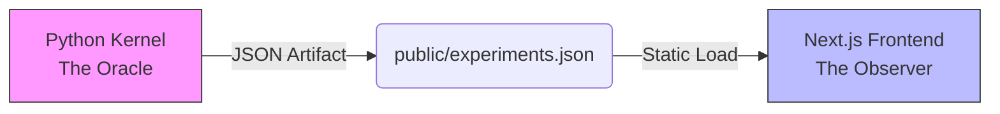

# Riemann Scale-Gauge Research Instrument

This repository is a **proof-program research instrument**, not a theory-verdict dashboard. It investigates whether a nontrivial multiplicative gauge can transport the RH-relevant analytic structure of ζ without changing the mathematical case — so that the compressed and uncompressed views are the same case for the purposes of the Riemann Hypothesis predicate. The canonical specification of what the project is and is not lives in [PROOF_PROGRAM_SPEC.md](PROOF_PROGRAM_SPEC.md); read that first.

> **Not every experiment is a verdict on the theory. Some validate implementation, some show the work, some witness proof obligations, and some guide future research.**

## 🏗️ Architecture: Oracle–Observer



1. **Oracle (backend).** `experiment_engine.py` + `riemann_math.py` + `verifier.py`, all running at 50-decimal `mpmath` precision. Computes integrals, summations, and zeros; grades the artifact; emits the canonical ontology (`function`, `outcome`, `epistemic_level`, `inference`, `proof_program`, `implementation_health`, `experiment_classification`).
2. **Observer (frontend).** Next.js app rooted at repo top (`app/`). Standard 64-bit float; pure visualization ("Zero Math Policy"). Reads `/experiments.json`.

## 📂 Documentation

| File | What it is |
|---|---|
| [PROOF_PROGRAM_SPEC.md](PROOF_PROGRAM_SPEC.md) | Canonical ontology + research semantics. Start here. |
| [THEORY.md](THEORY.md) | The theorem candidate, proof obligations, and witness map. |
| [MATH_README.md](MATH_README.md) | Derivations (explicit formula, Möbius inversion, algorithms). |
| [REPRODUCE.md](REPRODUCE.md) | Reviewer reproduction at five fidelity tiers. |
| [WITNESS_MAP_REVIEW.md](WITNESS_MAP_REVIEW.md) | Provisional witness-map review artifact and signoff gate criteria. |

## 🔗 Relationship to prior work

This repo does **not** re-verify RH for the first 10¹³ zeros — Odlyzko's numerical verification and Platt–Trudgian's RH-up-to-height bounds already did that at $k=0$. What it adds is a structural test: does the RH-relevant analytic structure survive the τ-indexed multiplicative gauge? If yes (and proof obligations `OBL_COORD_RECONSTRUCTION_COVARIANCE`, `OBL_ZERO_SCALING_EQUIVALENCE`, `OBL_BETA_INVARIANCE`, `OBL_EXACT_RH_TRANSPORT` hold), the external verification at $k=0$ propagates to the whole equivariance class. The repo extends — not replaces — Odlyzko and Platt–Trudgian.

## 🚀 Quick start

### 1. Run the engine

```bash
pip install mpmath
python experiment_engine.py --run all
```

Output: `public/experiments.json`. The engine also runs `verifier.py` inline, which attaches the canonical `function + outcome + epistemic_level + inference` classification and the `proof_program` object to the artifact.

### 2. Launch the dashboard

```bash
npm install
npm run dev
```

Open [http://localhost:7000](http://localhost:7000). The app renders the Proof Program Map (theorem candidate → obligations → open gaps) at the top, inference rails beside every active experiment, and a sidebar grouped by experiment function (with stage available as a secondary navigation toggle).

### 2b. Run the deterministic analyzer

```bash
npm run analyze     # equivalently: python -m analyzer
```

Reads `public/experiments.json` + `public/verdict_history.jsonl` and writes a Markdown interpretation to `reports/latest.md`. The analyzer applies a deterministic decision table (no LLM) that distinguishes coherence witnesses from controls from proof-obligation witnesses, firewalls Program 2 results from theorem state, and reads the obligation block as the authoritative source of truth for theorem-level progress. Use `python -m analyzer --check` for a CI-friendly exit code.

### 2c. Run tests

```bash
pip install -r requirements-dev.txt && pytest tests/   # Python suite
npm run test:js                                        # Jest suite (preferred)
npx jest                                               # also works — bridge tests use a child Node process for ESM
npm test                                               # Jest + pytest in one command
```

### 3. Configure run-control auth (deployed environments)

Copy `.env.example` to `.env.local` and set:

```bash
RESEARCH_RUN_TOKEN=<strong-random-token>
```

Run-control surfaces are bearer-protected outside local dev:

- HTTP: `POST /api/research/run`, `GET /api/research/run`, `GET /api/research/run/logs`, `GET /api/research/run/events`, `POST /api/research/run/cancel`, `POST /api/research/run/resume`
- MCP tools: `start_run`, `start_custom_run`, `get_run_status`, `get_run_logs`, `get_run_events`, `cancel_run`, `resume_run`
- Custom sidebar runs also post to `POST /api/research/run` with `kind: "custom"`; the old `/api/run-experiment` route has been removed.

If you want browser-triggered run controls against protected legacy routes, you can also set:

```bash
NEXT_PUBLIC_RESEARCH_RUN_TOKEN=<same-token-or-short-lived-token>
```

This value is exposed to the browser bundle, so treat it as low-trust and rotate it.

## Hosted vs Local Compute

- Hosted Vercel deployments are **read-only by default**. Visitors can explore charts, history, and research API read endpoints, but cannot trigger compute runs.
- Local clones/forks remain fully runnable by default (`verify`, `smoke`, `standard`, `authoritative`, `overkill`) with no extra policy setup.
- If you intentionally want hosted compute on your own forked deployment, set:

```bash
RESEARCH_ENABLE_HOSTED_RUNS=true
```

- To force read-only in any environment (including local), set:

```bash
RESEARCH_READ_ONLY=true
```

- Data shown on hosted deployments comes from committed artifact files in the deployed Git revision (for example `public/experiments.json` and `public/verdict_history.jsonl`).

## 🧪 Experiments

Organized by **function** — the job each experiment does in the proof program. Stage (`gauge` / `lattice` / `brittleness` / `control`) is preserved as a noncanonical grouping axis in the sidebar, but does **not** carry theorem semantics: there is no stage-level theorem-verdict rollup, and the stages are not ordered steps in a proof.

### Core calculation
The main theory-facing calculation is the video-style Riemann Converter, tested under the tau substitution.

1. **CORE-1: Harmonic Converter** — builds `Li(x_eff) - sum WavePair(gamma_j, x_eff)` at `x_eff = X/tau^k`, stores curves in `X` units, and reports tau-substitution invariance. The Mobius/J-wave reconstruction and scaled-coordinate stress branch are supporting diagnostics, not replacement theories.

### Zeta-direct views
These operate directly on zeta and are descriptive/informational only.

2. **ZETA-0: Critical Line Polar Trace** — visualizes zeta(1/2 + it) and marked zeros in the displayed t-window.
3. **TRANS-1: Zeta Gauge Transport** — measures zeta residuals under candidate multiplicative transports. It quantifies deviation; it does not prove a gauge automorphism.

### Proof-obligation witnesses (theorem-directed evidence)
Only this class — consistent outcome + AUTHORITATIVE fidelity — can produce positive evidence toward the theorem candidate.

4. **VAL-1: Critical line beta-stability** *(provisional)* — witnesses `OBL_BETA_INVARIANCE`. beta-hat stays at 1/2 under scaling on tested ranges and fidelity. Witness-map authority remains gated by review; no experiment is treated as settled theorem-directed evidence until signoff.

### Controls (instrument health, fidelity-independent)
Must fail on known-bad input. A passing control arms a falsifier; it is not evidence for the theory.

5. **CTRL-1: Operator scaling control** — naive operator scaling (rho/gamma alone) must break the reconstruction.
6. **CTRL-2: Beta counterfactual** — beta=pi reconstruction must diverge. Arms beta-stability.

### Research notes and pathfinders
These validate, explain, or choose branches. They do not settle theorem state.

7. **NOTE-1: Zero reuse note** — documents the relationship between zero reuse and coordinate scaling.
8. **PATH-1: Translation vs dilation** — returns `TRANSLATION` or `DILATION`.
9. **PATH-2: Zero correspondence** — returns `lattice-hit`, `lattice-weak`, or `lattice-path-negative`.

### Regression checks and demonstrations
A failure means a bug or missing data, not a theory update.

10. **REG-1: Scaled-zeta regression** — checks the scaled-zeta zero-generator identity numerically. Plumbing, not evidence.
11. **DEMO-1: Bounded-view demonstration** — illustrates bounded-window mechanics conditional on exact transport.

### Contradiction Track · Program 2
Brittleness experiments formalize the alternate contradiction-by-detectability route. They are not casual side work, but they remain non-theorem-directed until rogue detectability, no-hiding under compression, and contradiction closure are formalized.

12. **P2-1: Rogue centrifuge** — deep-zoom amplification under a planted beta offset.
13. **P2-2: Rogue isolation** — residual error scales as x^(Delta beta).
14. **P2-3: Calibrated sensitivity** — A(epsilon) monotonicity across an epsilon sweep.

### What would close the proof?

- `GAP_RH_PREDICATE_TRANSPORT`: exact transport of the RH predicate under the working gauge.
- `GAP_PROGRAM2_FORMALIZATION`: formal rogue/off-line zero amplification and detectability.
- `GAP_NO_HIDING_UNDER_COMPRESSION`: proof that compression cannot hide a rogue zero outside all bounded/verified views.
- `GAP_CONTRADICTION_CLOSURE`: proof that detectability plus no-hiding plus a verified bounded view forces the contradiction.

Every experiment record ships with mandatory `inference_scope`, `allowed_conclusion`, and `disallowed_conclusion` rails. The proof-discovery layer (below) keeps the static "if-passed" rails and the actual run inference visibly separate so a failed/inconclusive run can never display the static intended conclusion as if the data showed it.

## 🔬 Proof-Discovery Layer

Every experiment is registered with a **baseline hypothesis**, and every run produces structured per-experiment **reviews**, **model comparisons**, and **candidate lemmas** alongside a top-level **proof-discovery index**. The goal is to turn the suite from a verdict dashboard into a hypothesis-review and lemma-generation system.

### Artifacts produced per run

```
artifacts/runs/<run_id>/
├── experiments.json                    # raw verifier output (legacy)
├── summary.json                        # verifier summary (legacy)
├── certificate.json                    # Same-Object Certificate, when built
├── analysis.json + analysis.md         # claim-down rollup (legacy)
├── experiment_reviews/<exp_id>.json    # per-experiment baseline review
├── model_comparisons/<exp_id>.json     # observed vs. predicted, scoped consequence
├── lemmas/<exp_id>.md                  # candidate lemma / research note
├── hypothesis_proposals/<id>.json      # agent-proposed baseline updates (status: PROPOSED|ACCEPTED|REJECTED)
├── hypothesis_proposals/<id>.audit.json  # accept/reject audit trail
├── proof_discovery_index.json          # aggregated lemmas, formalization targets, coverage
└── proof_discovery.md                  # human-readable index
```

The canonical baseline-hypothesis registry lives at `proof_kernel/hypotheses/{program_1,program_2,controls,pathfinders,demonstrations}.json` (one entry per experiment, role-classified). Accepted proposals are layered on top via `proof_kernel/hypotheses/_accepted_overlays.json` so canonical files in git stay clean.

### Key separations enforced by every review

| Field | What it is |
|---|---|
| `intended_inference_if_passed` | Static rails — what the run *would* allow if the baseline were confirmed. **Never displayed as the conclusion of a failed/inconclusive run.** |
| `actual_run_inference` | Data-driven sentences for *this* run, generated from the verifier outcome + role + scoped consequence. |
| `model_comparison.baseline_status` | `CONFIRMED` / `FAILED` / `INCONCLUSIVE` / `INCOMPLETE` / `NOT_APPLICABLE` |
| `scoped_consequence` | `THEORY` / `FORMALIZATION` / `WITNESS` / `ROUTE` / `IMPLEMENTATION` / `BASELINE_MODEL` / `NONE`. Program 2 failures scope to BASELINE_MODEL/ROUTE first — never THEORY unless an NC4-bearing necessary condition is contradicted. |
| `candidate_lemmas[]` | `SUGGESTED_FROM_PASS` / `SUGGESTED_FROM_FAILURE` / `DEFERRED` / `NO_LEMMA_SUGGESTED`, each with `what_it_does_not_prove`. |
| `disallowed_conclusions` | Always rendered. |

`public/current.json` carries a `proof_discovery` block with directory paths, the API endpoint map, and a quick `coverage_complete` / `all_baselines_confirmed` / `experiments_not_run` signal.

### HTTP API (under `/api/research/`)

| Endpoint | Verb | Purpose |
|---|---|---|
| `experiment-reviews` (`/:id`) | GET | List or get per-experiment reviews. |
| `model-comparisons` (`/:id`) | GET | Observed-vs-predicted with `agent_review_priority`. |
| `candidate-lemmas` (`/:id`) | GET | Candidate-lemma payloads with markdown rendering. |
| `baseline-hypotheses` (`/:id`) | GET | Canonical registry (overlay-aware). |
| `proof-discovery` | GET | Run-level index + markdown. |
| `hypothesis-proposals` (`/:id`) | GET | List / fetch proposals + audit. |
| `hypothesis-proposals` | POST | Propose a baseline update (auth + write-enabled deployment). |
| `hypothesis-proposals/:id/accept` | POST | Accept (auth + write-enabled). |
| `hypothesis-proposals/:id/reject` | POST | Reject (auth + write-enabled). |

All proof-discovery endpoints accept stable IDs (`EXP_2B`), display IDs (`P2-2`), or aliases (`rogue-isolation`). Errors come through as ok=false envelopes with `{ok, schema_version, run_id, data, warnings, errors, plain_language_summary}` — never bare `{error}`. See [MCP_README.md](MCP_README.md) for the matching MCP tool surface.

### UI

The active-experiment area renders a single shared `<ExperimentReviewPanel>` ([components/ExperimentReviewPanel.tsx](components/ExperimentReviewPanel.tsx)) for every tab, with sub-components `<ModelComparisonPanel>` and `<CandidateLemmaPanel>`. The legacy single "may infer" callout was removed — no per-tab inference logic remains.

### Lean 4 formalization scaffold

The three Program 1 confirmed-witness lemmas have **statement-only** Lean 4 skeletons under [proof_kernel/lean/](proof_kernel/lean/):

| File | Witness experiment | Obligation |
|---|---|---|
| [FiniteReconstructionCovariance.lean](proof_kernel/lean/FiniteReconstructionCovariance.lean) | EXP_1 / CORE-1 | `OBL_COORD_RECONSTRUCTION_COVARIANCE` |
| [FiniteBetaStability.lean](proof_kernel/lean/FiniteBetaStability.lean) | EXP_6 / VAL-1 | `OBL_BETA_INVARIANCE` |
| [FiniteZeroScalingCorrespondence.lean](proof_kernel/lean/FiniteZeroScalingCorrespondence.lean) | EXP_8 / WIT-1 | `OBL_ZERO_SCALING_EQUIVALENCE` |

Every file follows the same pattern: a missing-hypotheses catalog (TODO-A1 … TODO-W6, 17 distinct primitives), `axiom` / `noncomputable def := sorry` stubs for each, the witness theorem with `sorry`, and a strengthened `_OBL` form (also `sorry`) recording the actual proof obligation the witness is a proxy for. See [proof_kernel/lean/README.md](proof_kernel/lean/README.md) for the consolidated catalog and extension protocol. **No `lakefile.lean` yet** — these are read-only formal targets until the toolchain is set up.

