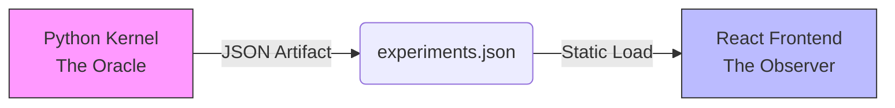

# Riemann Scale-Gauge Research Engine
### The Analytic Interferometer

The **Riemann Scale-Gauge Research Engine** is a specialized mathematical instrument designed to visually stress-test the Riemann Hypothesis (RH) under discrete scale-gauge transformations. It functions as an **Analytic Interferometer**, detecting structural instabilities in the Riemann Zeta function's analytic continuation by subjecting it to extreme scaling and parameter perturbation.

## 🏗️ Architecture: Oracle-Observer Pattern

The system enforces a strict separation of concerns to ensure mathematical rigor and eliminate floating-point errors (IEEE-754) from the visualization layer.



1.  **The Oracle (Background)**:
    *   **Logic**: `experiment_engine.py` (Python/mpmath).
    *   **Precision**: **50 Decimal Places**.
    *   **Role**: Computes Integrals, Summations, and Zeros. Generates the dataset.

2.  **The Observer (Frontend)**:
    *   **Logic**: `dashboard/` (Next.js/Recharts).
    *   **Precision**: Standard 64-bit Float.
    *   **Role**: Pure visualization. **Zero Math Policy**.

## 📂 Documentation Structure

*   [**Precise Claim**](THEORY.md): One-page statement of exactly what this repo asserts (Claims 1–4), what it does not, and how it sits on top of Odlyzko / Platt–Trudgian. **Start here for the epistemic posture.**
*   [**Mathematical Framework**](MATH_README.md): Detailed explanation of the explicit formula, the Möbius Inversion, and the specific algorithms used in the Python engine.
*   [**Reviewer Reproduction Guide**](REPRODUCE.md): How to rerun the evidence at five fidelity tiers, read the dashboard, and stress-test the claims.
*   [**Dashboard Documentation**](dashboard/README.md): Overview of the React frontend, the Zero-Math policy, and the UI components.

## 🔗 Relationship to Prior Work

This repo does **not** re-verify RH for the first 10¹³ zeros — Odlyzko's numerical verification and Platt–Trudgian's RH-up-to-height bounds already did that at $k=0$. What we add is a *structural test*: assuming the external verification at $k=0$ holds, do the gauge/lattice/brittleness claims (see [THEORY.md](THEORY.md)) propagate that verification to every scale $k \in \mathbb{Z}$ without recomputation? If yes, the external work buys a whole equivariance class; if any of Claims 1–4 fail, the structural payoff evaporates. This project *extends*, not replaces, Odlyzko and Platt–Trudgian.

## 🚀 Quick Start

### 1. Run the Engine (The Oracle)
Generate the high-precision data. This requires Python with `mpmath`.

```bash
# Python 3.8+ required
pip install mpmath

# Run all experiments
python experiment_engine.py --run all
```
*Output: `dashboard/public/experiments.json` (Includes generic automated verification verdicts)*

### 2. Launch the Dashboard (The Observer)
Visualize the results.

```bash
cd dashboard
npm install
npm run dev
```
Open [http://localhost:3000](http://localhost:3000) to view the Analytic Interferometer.

## 🧪 Experiments

Organized by theory stage (see `MATH_README.md §3.0`). **The stages are
not coequal.** Brittleness carries the falsifiable content; Gauge and
Lattice are the structural scaffolding that makes the brittleness
argument meaningful. Read the brittleness battery first.

**Brittleness (the falsifiable content)** — RH stress-test via rogue-zero amplification under deep zoom. If any zero in the covered ordinate range were off the critical line, these detectors should see it.

1.  **EXP-02: Centrifuge (Rogue Zero)**: infinitesimal $\beta = 0.5 \to 0.5001$ produces visible error amplification.
2.  **EXP-02B: Rogue Isolation**: residual error scales exactly as $x^{\Delta\beta}$ (isolates the single perturbed zero).
3.  **EXP-07: Calibrated Sensitivity**: local, relative metric for rogue amplification monotonicity across an $\varepsilon$ sweep.

**Gauge (scaffolding)** — coordinate scale-gauge symmetry under τ = 2π. Establishes that the reconstruction transforms covariantly under the chosen group action.

4.  **EXP-01: Equivariance (Coordinate Gauge)**: reconstruction is isometric under $X \to X/\tau^k$.
5.  **EXP-01B: Operator Gauge (Falsification)**: naive operator scaling (ρ, γ) breaks the symmetry — the gauge is rigid.
6.  **EXP-06: Critical Line Drift (load-bearing)**: $\hat\beta(k)$ stays at ½ under scaling. This is what licenses propagating the $k=0$ verification to other scales.

**Lattice (scaffolding)** — scaled zeros correspond to true Riemann zeros. Mostly a plumbing check on an identity we already assume.

7.  **EXP-01C: τ-Lattice Hypothesis**: scaling zeros by $\tau^k$ reconstructs the scaled prime lattice $P_k$.
8.  **EXP-04: Translation vs Dilation**: disambiguates trivial coord-shift from non-trivial operator scaling.
9.  **EXP-05: Zero Correspondence**: nearest-neighbor test — do scaled zeros land on true zeros?
10. **EXP-08: Scaled-Zeta Zero Equivalence**: zeros of ζ(s) scaled by $\tau^k$ vs zeros of ζ(s·τ^k). Plumbing check, not independent evidence — see [THEORY.md §2](THEORY.md).

**Control**

11. **EXP-03: Falsification (β=π)**: counter-factual that must diverge — meta-check that our falsifier is armed.

