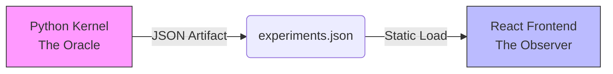

# Riemann Scale-Gauge Research Engine
### The Analytic Interferometer

The **Riemann Scale-Gauge Research Engine** is a specialized mathematical instrument designed to visually stress-test the Riemann Hypothesis (RH) under discrete scale-gauge transformations. It functions as an **Analytic Interferometer**, detecting structural instabilities in the Riemann Zeta function's analytic continuation by subjecting it to extreme scaling and parameter perturbation.

## 🏗️ Architecture: Oracle-Observer Pattern

The system enforces a strict separation of concerns to ensure mathematical rigor and eliminate floating-point errors (IEEE-754) from the visualization layer.



1.  **The Oracle (Background)**:
    *   **Logic**: `experiment_engine.py` (Python/mpmath).
    *   **Precision**: **50 Decimal Places**.
    *   **Role**: Computes Integrals, Summations, and Zeros. Generates the dataset.

2.  **The Observer (Frontend)**:
    *   **Logic**: `dashboard/` (Next.js/Recharts).
    *   **Precision**: Standard 64-bit Float.
    *   **Role**: Pure visualization. **Zero Math Policy**.

## 📂 Documentation Structure

*   [**Mathematical Framework**](MATH_README.md): Detailed explanation of the explicit formula, the Möbius Inversion, and the specific algorithms used in the Python engine.
*   [**Dashboard Documentation**](dashboard/README.md): Overview of the React frontend, the Zero-Math policy, and the UI components.

## 🚀 Quick Start

### 1. Run the Engine (The Oracle)
Generate the high-precision data. This requires Python with `mpmath`.

```bash
# Python 3.8+ required
pip install mpmath

# Run all experiments
python experiment_engine.py --run all
```
*Output: `dashboard/public/experiments.json` (Includes generic automated verification verdicts)*

### 2. Launch the Dashboard (The Observer)
Visualize the results.

```bash
cd dashboard
npm install
npm run dev
```
Open [http://localhost:3000](http://localhost:3000) to view the Analytic Interferometer.

## 🧪 Experiments

1.  **EXP-01: Equivariance (Scale Invariance)**: Verifying that the explicit formula holds structure across global scale transformations ($X \to X/\tau^k$).
2.  **EXP-02: Centrifuge (Rogue Zero)**: Testing the "brittleness" of the reconstruction against infinitesimal perturbations ($\beta=0.5 \to 0.5001$).
3.  **EXP-03: Falsification (Beta=Pi)**: A counter-factual test to verify divergence under non-physical parameters.
4.  **EXP-04: Translation vs Dilation**: Disambiguating coordinate shifts from operator scaling.
5.  **EXP-05: Zero Correspondence**: Testing if scaled zeros map to existing zeros (Lattice Hypothesis).
6.  **EXP-06: Critical Line Drift**: Measuring implicit Beta drift under scaling.
7.  **EXP-07: Centrifuge Fix**: Calibrated sensitivity test for rogue zero amplification.

## Zeta Transform Explorer (New)

A standalone visualization module is available at `/zeta`.
This tool renders the conformal mapping $w = \zeta(s)$ with high-precision (50 dps) and allows applying various "$\tau$-lenses" to the input and output planes.

### Features
- **Arbitrary Precision**: Uses `mpmath` backend to compute $\zeta(s)$ without standard float errors.
- **Interactive Lenses**:
  - $A_k(s)$: Input deformations (e.g., imaginary axis scaling).
  - $B_k(w)$: Output deformations.
- **Visual Verification**: Checks zero crossings and grid mapping integrity.
