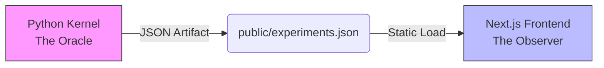

# Riemann Scale-Gauge Research Instrument

This repository is a **proof-program research instrument**, not a theory-verdict dashboard. It investigates whether a nontrivial multiplicative gauge can transport the RH-relevant analytic structure of ζ without changing the mathematical case — so that the compressed and uncompressed views are the same case for the purposes of the Riemann Hypothesis predicate. The canonical specification of what the project is and is not lives in [PROOF_PROGRAM_SPEC.md](PROOF_PROGRAM_SPEC.md); read that first.

> **Not every experiment is a verdict on the theory. Some validate implementation, some show the work, some witness proof obligations, and some guide future research.**

## 🏗️ Architecture: Oracle–Observer



1. **Oracle (backend).** `experiment_engine.py` + `riemann_math.py` + `verifier.py`, all running at 50-decimal `mpmath` precision. Computes integrals, summations, and zeros; grades the artifact; emits the canonical ontology (`function`, `outcome`, `epistemic_level`, `inference`, `proof_program`, `implementation_health`, `experiment_classification`).
2. **Observer (frontend).** Next.js app rooted at repo top (`app/`). Standard 64-bit float; pure visualization ("Zero Math Policy"). Reads `/experiments.json`.

## 📂 Documentation

| File | What it is |
|---|---|
| [PROOF_PROGRAM_SPEC.md](PROOF_PROGRAM_SPEC.md) | Canonical ontology + research semantics. Start here. |
| [THEORY.md](THEORY.md) | The theorem candidate, proof obligations, and witness map. |
| [MATH_README.md](MATH_README.md) | Derivations (explicit formula, Möbius inversion, algorithms). |
| [REPRODUCE.md](REPRODUCE.md) | Reviewer reproduction at five fidelity tiers. |
| [WITNESS_MAP_REVIEW.md](WITNESS_MAP_REVIEW.md) | Provisional witness-map review artifact and signoff gate criteria. |

## 🔗 Relationship to prior work

This repo does **not** re-verify RH for the first 10¹³ zeros — Odlyzko's numerical verification and Platt–Trudgian's RH-up-to-height bounds already did that at $k=0$. What it adds is a structural test: does the RH-relevant analytic structure survive the τ-indexed multiplicative gauge? If yes (and proof obligations `OBL_COORD_RECONSTRUCTION_COVARIANCE`, `OBL_ZERO_SCALING_EQUIVALENCE`, `OBL_BETA_INVARIANCE`, `OBL_EXACT_RH_TRANSPORT` hold), the external verification at $k=0$ propagates to the whole equivariance class. The repo extends — not replaces — Odlyzko and Platt–Trudgian.

## 🚀 Quick start

### 1. Run the engine

```bash
pip install mpmath
python experiment_engine.py --run all
```

Output: `public/experiments.json`. The engine also runs `verifier.py` inline, which attaches the canonical `function + outcome + epistemic_level + inference` classification and the `proof_program` object to the artifact.

### 2. Launch the dashboard

```bash
npm install
npm run dev
```

Open [http://localhost:7000](http://localhost:7000). The app renders the Proof Program Map (theorem candidate → obligations → open gaps) at the top, inference rails beside every active experiment, and a sidebar grouped by experiment function (with stage available as a secondary navigation toggle).

### 3. Configure run-control auth (deployed environments)

Copy `.env.example` to `.env.local` and set:

```bash
RESEARCH_RUN_TOKEN=<strong-random-token>
```

Run-control surfaces are bearer-protected outside local dev:

- HTTP: `POST /api/research/run`, `GET /api/research/run`, `GET /api/research/run/logs`
- MCP tools: `start_run`, `get_run_status`, `get_run_logs`
- Legacy UI routes: `/api/rerun`, `/api/run-experiment`

If you want browser-triggered run controls against protected legacy routes, you can also set:

```bash
NEXT_PUBLIC_RESEARCH_RUN_TOKEN=<same-token-or-short-lived-token>
```

This value is exposed to the browser bundle, so treat it as low-trust and rotate it.

## 🧪 Experiments

Organized by **function** — the job each experiment does in the proof program. Stage (`gauge` / `lattice` / `brittleness` / `control`) is preserved as a noncanonical grouping axis in the sidebar, but does **not** carry theorem semantics: there is no stage-level theorem-verdict rollup, and the stages are not ordered steps in a proof.

### Proof-obligation witnesses (theorem-directed evidence)
Only this class — consistent outcome + AUTHORITATIVE fidelity — produces positive evidence toward the theorem candidate.

1. **EXP-06: Critical line β-stability** *(provisional)* — witnesses `OBL_BETA_INVARIANCE`. $\hat\beta(k)$ stays at ½ under scaling on tested ranges and fidelity. Witness-map authority is gated by Sprint 3b.0 review (see [WITNESS_MAP_REVIEW.md](WITNESS_MAP_REVIEW.md) and `GAP_WITNESS_MAP_REVIEW`); no experiment is treated as settled theorem-directed evidence until signoff.

### Coherence witnesses ("showing the work")
Demonstrate that the reconstruction machinery is internally consistent. Not themselves evidence for the theorem.

2. **EXP-01: Equivariance (coordinate gauge)** — reconstruction is covariant under $X \to X/\tau^k$ on the tested k-range.
3. **EXP-01C: Zero scaling** — scaling zeros by $\tau^k$ is isometric to scaling the lattice by $\tau^k$ within documented drift/ratio tolerances.

### Controls (instrument health, fidelity-independent)
Must fail on known-bad input. A passing control arms a falsifier; it is not evidence for the theory.

4. **EXP-01B: Operator gauge (naive scaling)** — naive operator scaling (ρ, γ alone) must break the reconstruction. Arms the coordinate-gauge claim.
5. **EXP-03: β=π counterfactual** — β=π reconstruction must diverge. Arms β-stability.

### Pathfinders (direction selectors)
Pick a branch of the research tree. Outcome is directional, not supporting/refuting.

6. **EXP-04: Translation vs dilation** — returns `TRANSLATION` or `DILATION`.
7. **EXP-05: Zero correspondence** — returns `lattice-hit`, `lattice-weak`, or `lattice-path-negative`.

### Regression checks (engine plumbing)
A failure means a bug, not a theory update.

8. **EXP-08: Scaled-ζ zero equivalence** — the zero-generator respects the $\zeta(s\cdot\tau^k)$ identity numerically. Plumbing, not evidence — see [THEORY.md](THEORY.md).

### Exploratory · Program 2 (contradiction-by-detectability, retained not retired)
Brittleness experiments. **Not on the present proof-critical path** under the canonical Program 1 posture; retained as diagnostic tooling and a possible future route.

9. **EXP-02: Centrifuge (planted rogue zero)** — deep-zoom amplification under a planted $\beta = 0.5001$.
10. **EXP-02B: Rogue isolation** — residual error scales as $x^{\Delta\beta}$.
11. **EXP-07: Calibrated sensitivity** — $A(\varepsilon)$ monotonicity across an $\varepsilon$ sweep.

Every experiment record ships with mandatory `inference_scope`, `allowed_conclusion`, and `disallowed_conclusion` rails; the UI renders at least one next to every verdict. Those rails are the drift guardrail.

